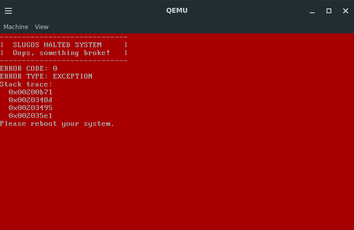

# Red Screen Of Death

## What is the RSOD?

### What does the RSOD look like?

### What does the RSOD do?

The RSOD is a error reporting method for critical errors in SlugOS.

#### How does the RSOD work?

The RSOD follows these steps (in order)

- Disables interrupts
- Set the background color to red
- Clear the screen (sets background to red everywhere)
- Print out the banner
- Print out the error code
- Prints out the error type
- Runs a stack trace
- Tells the user to reboot
- Halts the CPU

### Types of RSOD error

It has a few types of error

- Exception
- Kernel panic (generic)
- Unkown Error

### What do I do if I get a RSOD?

In the (likely) case you get a RSOD assuming you compiled the build yourself, check these things

- in make.config in the EXTRA_DEFINES make sure that you do not have RSOD in EXTRA_DEFINES or else it will trigger an RSOD on purpose.

- check that it is not an exception, if it is, that means that SlugOS must have done something to cause one of [these](https://wiki.osdev.org/Exceptions)